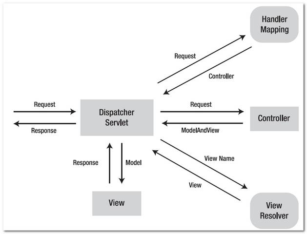

W tym artykule dowiesz się czym jest `Servlet`, `DispatcherServlet`, jak on działa oraz dlaczego znacznie ułatwia budowanie aplikacji na Spring MVC.

## Servlet
Czym więc jest sam *servlet*? Niestety słowo to nie ma żadnego sensownego zamiennika na inny wyraz, więc po samej nazwie ciężko się domyślić czym ten twór jest. Posłużmy się więc [oficjalną definicją od Oracle](https://docs.oracle.com/javaee/6/tutorial/doc/bnafe.html):

> **Serwlet** to **klasa** w języku programowania Java, która służy do rozszerzana możliwości serwerów obsługujących aplikacje, do których dostęp uzyskuje się za pomocą modelu programowania żądanie-odpowiedź (*request-response*). Chociaż serwlety mogą odpowiadać na każdy rodzaj żądań, są powszechnie używane do rozszerzania aplikacji obsługiwanych przez serwery WWW. Dla takich aplikacji technologia Java Servlet definiuje klasy serwletów specyficzne dla HTTP.

Jak to zwykle bywa z definicjami, nie wiele potrafią one pomóc, a ich zrozumienie bywa męczące. Pozwól więc, że wytłumaczę Ci to własnymi słowami. **Serwlet** jest niczym innym jak klasą, do której trafiają zapytania od serwera WWW (np. [Tomcat](https://tomcat.apache.org/)). Nie musisz więc pisać serwera ręcznie, od tego powstały już dawno gotowe narzędzia. Twoim jedynym zadaniem jest napisanie klasy, która przyjmie żądanie, obsłuży je oraz wyśle odpowiedź. W definicji pisze też, że mogą one odpowiadać na każdy rodzaj żądań. Jest to oczywiście prawdą, ale największe zastosowanie znalazły one w aplikacjach webowych we współpracy z protokołem HTTP i to właśnie tam się ich najczęściej używa. Nie jest to takie trudne, prawda?

## DispatcherServlet
Nie trudno się domyślić, że **DispatcherServlet** jest... tak!, serwletem lub zamiennie nazywanym **Front Controller'em** czyli kontrolerem, który obsługuje wszystkie żądania strony internetowej. Aplikacja Spring MVC posiada tylko **jeden** serwlet dla wszystkich żądań. Gdyby tak nie było, musiałbyś m.in. tworzyć ręcznie oddzielne serwlety na każdy adres URL, a to byłoby trochę męczące, nie sądzisz? Podziękuj więc twórcom Springa, że zwolnili Cię z tak ciężkiej roboty! Przyjrzyjmy się więc bliżej temu, jak ten DispatcherServlet działa.

Wyjaśnijmy sobie teraz krok po kroku co dzieje się na powyższym diagramie:
1. Żądanie od klienta kierowane jest do `DispatcherServlet'a`,
2. `DispatcherServlet` przekazuje żądanie do `HandlerMapping`, który mapuje Request URL z handlerem. Innymi słowy, przeszukuje wszystkie zarejestrowane kontrolery i zwraca ten, który obsługuje żądanie ze wskazanym adresem URL. Znaleziony kontroler wraca ponownie do `DispatcherServlet'a`,
3. `DispatcherServlet` przekazuje żądanie do zwróconego kontrolera (a dokładniej to metody, która to żądanie obsłuży),
4. Metoda w kontrolerze przetwarza żądanie oraz zwraca stworzony `Model` (obiekt, który jest odpowiedzialny za przechowywanie danych) wraz z `View Name` (`String`). Obiekty te ponownie trafiają do `DispatcherServlet'a`,
5. `DispatcherServlet` przekazuje zwrócony `View Name` do `ViewResolver`, który szuka widoku po jego nazwie oraz zwraca go do `DispatcherServlet` w postaci obiektu `View`. Sposób szukania widoku różni się w zależności od wybranej implementacji `ViewResolver'a`,
6. `DispatcherServlet` przekazuje wcześniej zwrócony `Model` do obiektu `View` z `ViewResolver'a`,
7. `View` przekazuje do `DispatcherServlet'a` odpowiedź w postaci wyjściowego interfejsu użytkownika,
8. `DispatcherServlet` wysyła odpowiedź do klienta.

## Podsumowanie
Mam nadzieję, że po przeczytaniu tego posta jesteś ekspertem w tematach związanych z DispatcherServlet'em oraz bez problemu potrafiłbyś wytłumaczyć komuś, co to jest, gdyby Cię o to zapytał. Daj znać czy post Ci się spodobał oraz zachęcam do poczytania innych artykułów.