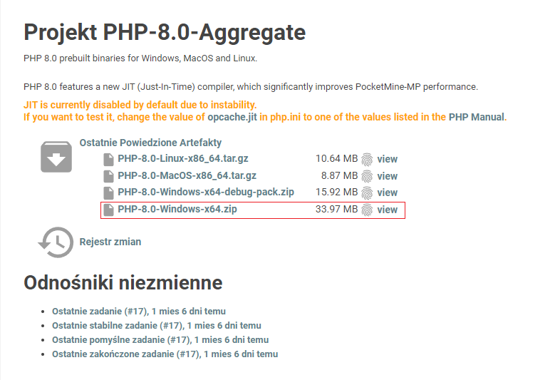
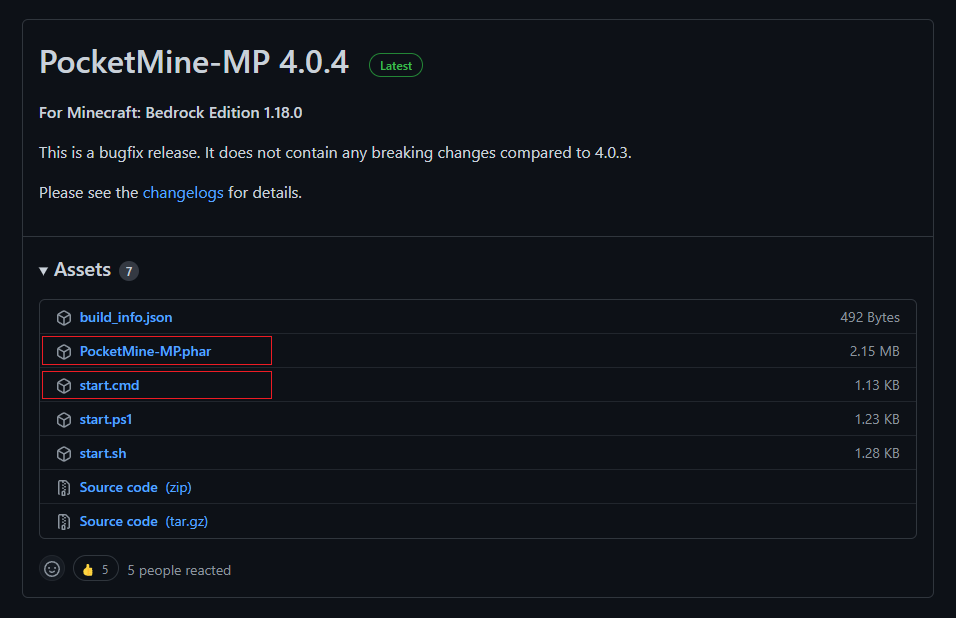
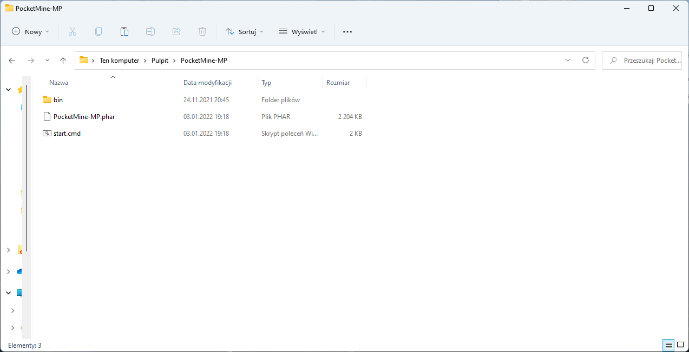
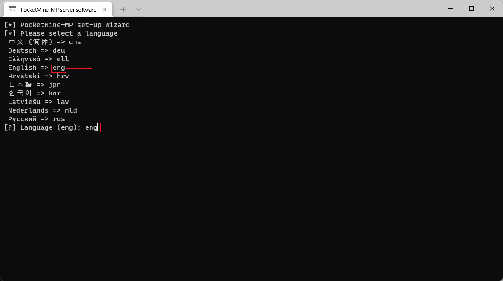
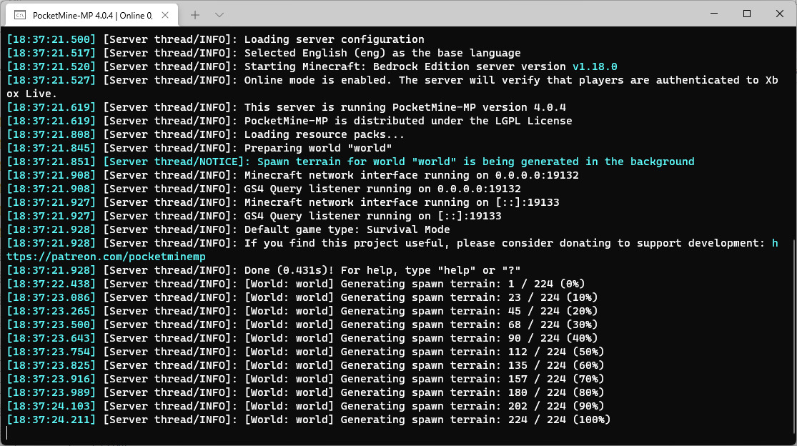
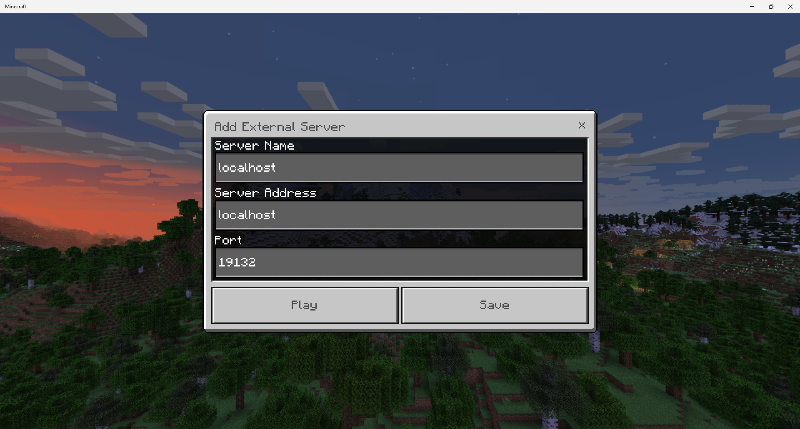
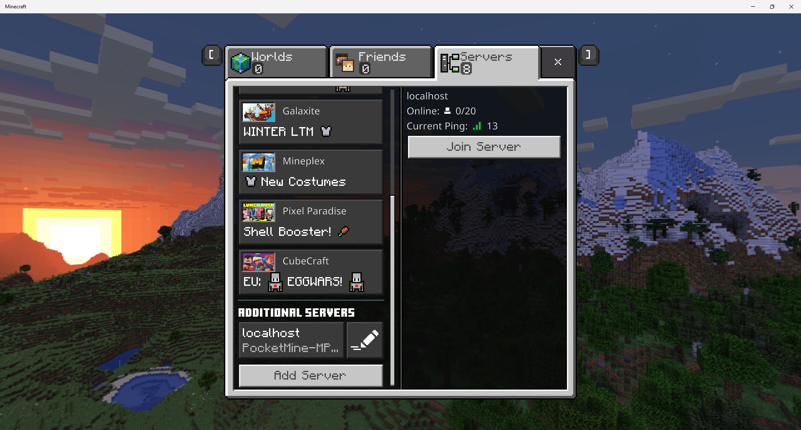
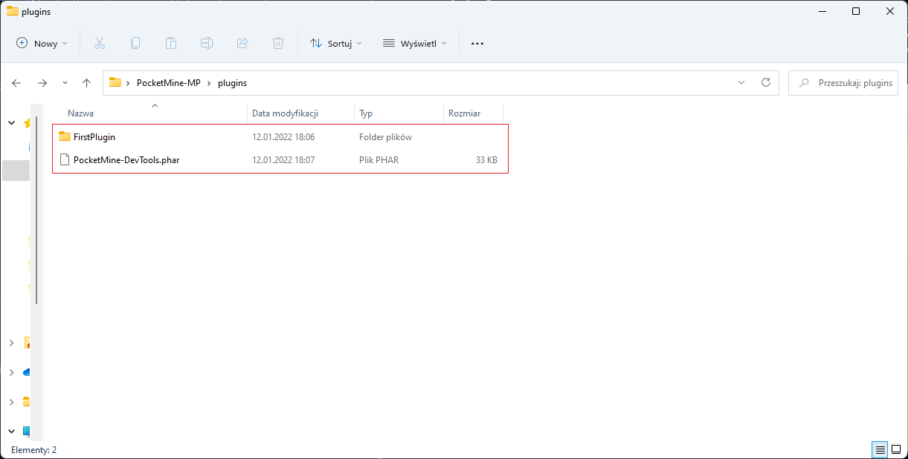
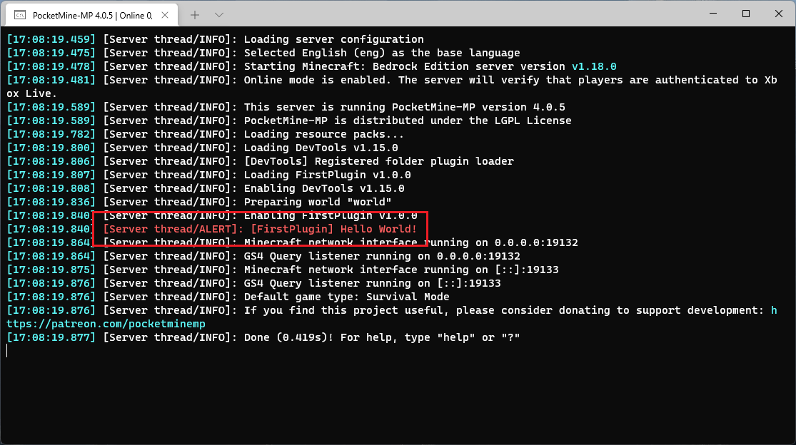

## Zanim zaczniesz pisać pluginy
Pluginy do MCBE piszemy w <b>języku PHP</b>, co oznacza, że przed przystąpieniem do tworzenia ich <b>musisz się go nauczyć</b>. Prawdopodobnie większość osób skojarzy ten język z pisaniem backendu, ale jest to trochę bardziej skomplikowane, niż może się wydawać. Język programowania w wielkim uproszczeniu to <b>specjalny język służący do porozumiewania się z komputerem</b>. Dzięki temu możemy go wykorzystać na wiele różnych sposobów. Tak się akurat złożyło, że PHP jest najbardziej spopularyzowany w zakresie backendu, dlatego prawdopodobnie wyszukując informacje na temat tego języka, znajdziesz głównie o nim informacje. Nie oznacza to natomiast, że PHP posiada <b>tylko jedno zastosowanie</b>. Wiele osób programuje w nim masę innych rzeczy, takich jak np. <b>boty na discorda</b> czy <b>pluginy do MCBE</b>. Dlatego nie ważne, jakie główne zastosowanie posiada język — musisz się go nauczyć. Nie jest istotne co będziesz pisał, <b>zawsze wykorzystasz podstawowe zagadnienia</b>, takie jak np. zmienne, instrukcje warunkowe, pętlę, klasy, metody etc. Pisanie pluginów jest jedynie <b>jednym z wielu zastosowań języka</b>.

### Jak nauczyć się PHP?
W przypadku gdy język PHP jest Twoim pierwszym językiem i nigdy nie miałeś styczności z programowaniem, <b>zachęcamy kupić kurs</b>. Poznasz dzięki temu, jak dokładnie działa programowanie oraz poznasz jego podstawowe zagadnienia. Jeżeli nie wiesz, gdzie można znaleźć tanie i dobre kursy online, polecamy zerknąć na stronę [udemy.com](https://udemy.com). Ważne jest, abyś dobrze opanował nie tylko <b>postawy języka, ale również całe programowanie obiektowe</b>, ponieważ będziesz z niego korzystał na co dzień, pisząc pluginy. Jeśli jednak miałeś już styczność z programowaniem i czujesz się pewnie, pisząc obiektowo, możesz <b>sam nauczyć się PHP</b>. Dużo rzeczy, które znasz z X języka, również znajdują się w PHP, ale mają po prostu inną składnię. Można oczywiście próbować pisać pluginy bez znajomości języka, ale prawdopodobnie nic nie zrozumiesz i szybko się poddasz.

## Serwer lokalny
Lokalny serwer jest zwykłym serwerem MCBE z kilkoma ograniczeniami. Przede wszystkim serwer uruchamiasz na <b>swoim prywatnym komputerze</b>, co oznacza, że serwer będzie on włączony tak długo, jak <b>uruchomiony jest Twój komputer</b>. Serwer odpalasz również na swojej sieci domowej, co powoduje m.in. <b>blokadę wejścia na serwer klientów podłączyć spoza Twojej sieci</b>. Można to oczywiście obejść, odblokowując port w routerze, ale ze względów bezpieczeństwa nie zalecamy tego robić. Serwer będzie służył tylko do <b>testowania naszych pluginów</b>.

### Krok 1: Pobranie plików PHP
Twoim pierwszym krokiem jest pobranie <b>plików PHP</b>, które będą potem odpowiedzialne za odpalenie silnika. W tym celu udaj się na stronę [https://jenkins.pmmp.io/job/PHP-8.0-Aggregate/](https://jenkins.pmmp.io/job/PHP-8.0-Aggregate/), a następnie pobierz odpowiedni plik: <b>PHP-8.0-Windows-x64.zip</b>.

### Krok 2: Pobranie silnika oraz pliku startowego
Naszym następnym krokiem będzie pobranie zbudowanego silnika oraz specjalnego pliku, który pozwoli go uruchomić. Udaj się w tym celu na stronę [https://github.com/pmmp/PocketMine-MP/releases](https://github.com/pmmp/PocketMine-MP/releases), a następnie upewnij się, że masz <b>wybraną najnowszą wersję</b> (w tym przypadku 4.0.4). Pobierz dwa pliki: <b>PocketMine-MP.phar</b> oraz <b>start.cmd</b>.

### Krok 3: Skompletowanie plików
Teraz musisz utworzyć folder, w którym będziesz trzymał <b>wszystkie pliki serwerowe</b>. Musisz do niego przekopiować następujące pliki:
- folder <b>bin</b> - znajdziesz go w plikach PHP, które wcześniej pobrałeś,
- <b>PocketMine-MP.phar</b>,
- <b>start.cmd</b>.

Całość powinna prezentować się następująco:

### Krok 4: Odpalenie serwera
Teraz nadszedł czas na odpalenie serwera. Przejdź do wcześniej utworzonego folderu, a następnie odpal plik <b>start.bat</b>. Otworzy Ci się konsola serwerowa.

Przyszedł czas na podstawową konfigurację. W pierwszej kolejności <b>wybierz język</b>, ja wybrałem angielski, ale możesz wybrać dowolny - lista znajduje się na górze konsoli.

Kliknij <b>Enter</b>. Znajdziesz się następnie w kroku drugim: akceptacja licencji oraz wybór kreatora konfiguracji. W dwóch przypadkach wpisz <b>Y</b> zatwierdzając to <b>enterem</b>.

Teraz musisz chwilę poczekać, ponieważ twój serwer się uruchamia. Podczas tego procesu tworzą się m.in. <b>podstawowe pliki</b> czy <b>generuje się świat</b>.

Brawo! Uruchomiłeś swój lokalny serwer. Jesteś teraz w stanie na niego wejść z poziomu gry.

### Krok 5: Dodanie serwera do listy
Jeżeli chcesz wejść na serwer, musisz go dodać do listy serwerów. Nazwa serwera może być dowolna (w moim przypadku localhost). W adresie serwera wpisz <b>localhost</b>, a port ustaw na <b>19132</b>.

Jeżeli wszystkie dane wpisałeś poprawnie, na liście powinien pojawić się nowy serwer, który jest poprawnie pingowany.

>Uwaga
>
> Może dojść do sytuacji, w której poprawnie wpisałeś wszystkie dane, a mimo wszystko Twój serwer nie odpowiada. Należy odpalić wtedy <b>powershell</b> z uprawnieniami administratora, a następnie wkleić tę komendę:
>
> <b>CheckNetIsolation LoopbackExempt -a -n="Microsoft.MinecraftUWP_8wekyb3d8bbwe"</b>
> 
> Po wpisaniu zrestartuj serwer i spróbuj ponownie na niego wejść.

## Środowisko programistyczne

Środowisko programistyczne (IDE) to <b>program, w którym będziemy programować nasze pluginy</b>. Najbardziej popularnym środowiskiem do języka PHP jest [PhpStorm](https://www.jetbrains.com/phpstorm/) i to właśnie z niego będziemy korzystać podczas tego kursu. Jedynym minusem jest to, że <b>jest to środowisko płatne</b> jednak nie martw się - JetBrains daje darmowe 30 dni na przetestowanie go. Jeżeli chcesz uzyskać darmową, roczną licencję na wszystkie produkty JetBrains, koniecznie zapoznaj się z naszym postem [Jak zdobyć licencję studencką na wszystkie produkty JetBrains](#).

### Instalacja środowiska
Link do instalatora PhpStorm znajdziesz [tutaj](https://www.jetbrains.com/phpstorm/download/download-thanks.html). Wystarczy, że <b>odpalisz</b> wcześniej pobrany plik .exe, a następnie <b>przejdziesz krok po kroku przez proces instalacji</b>. Szczegółową konfigurację środowiska omówiliśmy w [tym artykule](#).

## Pierwszy plugin
Aby upewnić się, że wszystko działa prawidłowo i jesteś gotowy do nauki pisania pluginów, <b>odpalimy na serwerze nasz pierwszy, testowy plugin</b>. Nie martw się, jeżeli nie rozumiesz kodu źródłowego tej wtyczki — <b>podstawami zajmiemy się w kolejnych artykułach.</b>

### Pobieranie pluginu
Testowy plugin możesz pobrać [z tego linku](files/kurs-pisania-pluginow-do-mcbe-wprowadzenie/FirstPlugin.zip). Wystarczy, że wejdziesz na podany link, a następnie plugin zacznie się sam pobierać.

### Instalacja pluginu
Instalacja pluginu jest banalnie prosta. Jedynie co musisz zrobić, to <b>przenieść cały folder</b> z zawartością pluginu do folderu <b>plugins</b>, który znajduje się w <b>Twoich plikach serwerowych</b>. Istotną kwestią jest również pobranie pluginu o nazwie [DevTools](https://poggit.pmmp.io/p/DevTools). PocketMine domyślnie ładuje tylko zbudowane pluginy, czyli takie, które posiadają końcówkę <b>phar</b>. DevTools pozwoli nam rozszerzyć ten zakres, ponieważ dzięki niemu będziemy mogli załadować również wtyczki znajdujące się w folderze. Jeżeli wszystko zrobiłeś zgodnie z instrukcją, Twój folder powinien prezentować się następująco:

### Odpalenie pluginu
Ostatnim krokiem jest odpalenie naszego serwera. Jeżeli wszystko zrobiłeś poprawnie, w Twojej konsoli powinien pojawić się napis <b>Hello World!</b>:

🥳<b>Świetnie!</b> To już wszystko w tym poście. Pewnie jesteś delikatnie zdenerwowany, że nie liznęliśmy jeszcze pisania pluginów, ale najpierw musieliśmy przejść przez <b>wymaganą konfigurację w celu komfortowego pisania</b>. W następnym poście zajmiemy się omówieniem struktury plików naszego testowego pluginu oraz nieco zagłębimy się w treść plików.