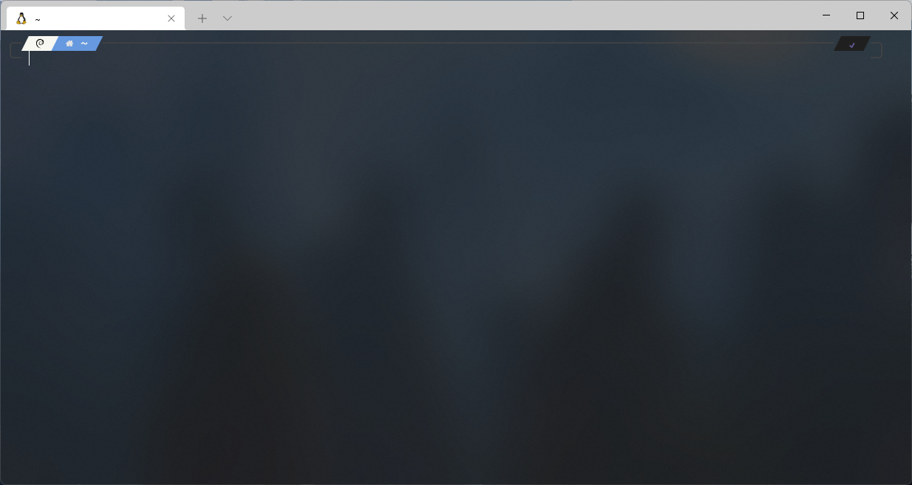

## Wprowadzenie
Nie od dziś wiadomo, że programista na windowsie to mem. Jest mnóstwo narzędzi, takie jak np. **git**, **docker**, **redis**, czy **nginx** które znacznie lepiej działają na Linuxie. Zostaje nam więc albo zakupić MacBooka, albo zainstalować linuxa za fizycznym sprzęcie. Jednakże nie wszyscy mają możliwość zainstalowania pingina na swoim komputerze. Być może również nie chcą tego robić bo lubią od czasu do czasu odpalić jakąś grę lub nie przepadają za linuxem w wersji GUI. I tu z pomocą przychodzi nam WSL.

### Czym jest WSL?
WSL, a dokładniej **Windows Subsystem for Linux** pozwala na **uruchomienie linuxa na Twoim komputerze z systemem Windows**. Możesz się zastanawiać - no dobra, ale w czym to jest lepsze od zwykłej wirtualnej maszyny? Powodów jest kilka i postaram Ci się je krótko opisać. Przede wszystkim WSL **zużywa bardzo mało zasobów** w porównaniu do takiego virtualboxa. Kolejną zaletą jest to, że **WSL nie zachowuje się jak wirtualna maszyna odseparowana od fizycznego sprzętu** - jest on zintegrowany z naszym windowsem co daje nam mnóstwo możliwości. Nie ma żadnego problemu abyś w eksploratorze plików przeglądał pliki linuxa i na odwrót - możesz przeglądać pliki windowsa będąc na linuxie. Być może jesteś osobą, która nie potrafi poruszać się po terminalu używając komend windowsowych i nawet najmniejsze zadanie sprawia Ci problem. Wdrażając w życie WSL ten problem już nie wystąpi, ponieważ **zyskujesz wszystkie unixowe komendy**. Warto też wspomnieć o programach, które wspierają WSL co jeszcze bardziej usprawnia naszą pracę. W przypadku Visual Studio Code możemy bez problemu użyć komendy **code .**, która otworzy nam w edytorze wybrany folder. Podsumowując to wszystko jesteśmy w stanie korzystać z windowsa jako głównego systemu, a gdy przyjdzie moment na programowanie - odpalamy naszego WSL i cieszymy się komendami unixowiym oraz działającymi usługami potrzebnymi do pracy.
No dobra, ale jak to wszystko zainstalować? Zasadniczo nie jest to ciężki proces. Wystarczy tylko trochę motywacji i chwila wolnego czasu.

## Proces instalacji i konfiguracji

### Krok 1: Włączenie podsystemu Windows dla systemu Linux
Aby zacząć pracę z naszym WSL, musisz go przede wszystkim włączyć. Przejdź do **Panel sterowania** -> **Programy** -> **Włącz lub wyłącz funkcje systemu Windows**. Teraz upewnij się, że masz zaznaczoną opcję **"Podsystem Windows dla systemu Linux"**. Jeżeli właśnie ją zaznaczyłeś, zostaniesz poproszony o zrestartowanie komputera. Po ponownym uruchomieniu funkcja WSL powinna być dostępna na Twoim komputerze.

### Krok 2: Pobranie odpowiednich programów
Udaj się do Microsoft Store, a następnie wyszukaj w wyszukiwarce frazę **"WSL"**. Jak widzisz wyników wyszukiwania jest dość sporo. Teraz możesz wybrać sobie dystrybucję, która będzie dla Ciebie najlepsza. Ja na potrzeby tego poradnika wybiorę Debiana. Po wybraniu dystrybucji kliknij na nią, a następnie kliknij przycisk zainstaluj.

Choć nie jest to wymagane do działania WSL, polecam jeszcze zainstalować aplikację o nazwie "Windows Terminal". Twórcami tego oprogramowania jest Microsoft i jest ono znacznie lepsze od defaultowego terminala. Jest znacznie przyjemniejszy dla oka, pozwala na prostą customizację oraz posiada kilka fajnych featureów takich jak multi-pane. Jeżeli korzystasz z windowsa 11, prawdopodobnie będzie to domyślnie zainstalowana aplikacja i nie musisz już tego robić.

### Krok 3: Odpalenie naszego systemu
Świetnie! Wszystkie kroki związane z instalacją WSL zostały już zrealizowane. Teraz przyszedł czas na odpalenie go oraz prostą konfigurację. W wyszukiwarce programów wyszukaj wcześniej pobraną dystrybucję (w moim przypadku Debian).

Jak widzisz, odpaliła Ci się konsola. Na razie jest to konsola WSL, ale w późniejszej części artykułu porozmawiajmy o tym jak możemy odpalić WSL na nowym terminalu od Microsoft.

**UWAGA!** Istnieje szansa, że po uruchomieniu wyskoczy Ci komunikat o zrobieniu aktualizacji do WSL2. Musisz wtedy skorzystać z [oficjalnego poradnika od Microsoft](https://docs.microsoft.com/en-us/windows/wsl/install-manual), aby ten update przeprowadzić. Gdy już to zrobisz, możesz spokojnie powrócić do tej części artykułu.

Teraz musimy wpisać podstawowe informacje na temat naszego systemu. W tym celu wpisz swoją nazwę użytkownika oraz hasło.

I to wszystko! Nasz WSL został już zainstalowany i możesz z niego korzystać jak z normalnego linuxa. Jeżeli nie interesuje Cię proces głębszej konfiguracji i customizacji, **możesz już zamknąć ten poradnik** i zacząć bawić się swoim WSL. My jednak pójdziemy o krok dalej i wdrożymy kilka usprawnień, aby nasza praca stała się znacznie przyjemniejsza.

## Wprowadzenie zmian kosmetycznych

### Krok 1: Instalacja ZSH
Domyślna powłoka wykorzystywana przez Linuxa nosi nazwę **"bash"**. Powłokę tą można oczywiście zmienić i my skorzystamy z tego przywileju, instalując ZSH. Tylko dlaczego jest ona lepsza od domyślnego bash? Założeniem ZSH jest, aby była to powłoka, którą **można dowolnie konfigurować**. Warto też wspomnieć o **szerokiej gamie rozszerzeń**, którą posiada.

Proces instalacji jest bardzo prosty i nie różni się niczym od instalacji każdego innego pakietu na Linuxie. Posłuży nam do tego jedna komenda: **sudo apt install zsh**. I to wszystko, nasza nowa powłoka została już zainstalowana.

### Krok 2: Utworzenie configu ZSH
Żeby skorzystać z nowo zainstalowanej powłoki, użyj komendy **zsh**. Jak widzisz, na ekranie pojawił Ci się komunikat, odnoście pliki konfiguracyjnego. Musisz wybrać tutaj opcje **0**.

### Krok 3: Instalacja OhMyZsh
**OhMyZsh** to framework służący do **zarządzania konfiguracją naszego zsh**. Proces instalacji jest równie prosty, jak w przypadku instalacji samej powłoki. Posłuży nam do tego jedna komenda: **sh -c "$(curl -fsSL https://raw.githubusercontent.com/ohmyzsh/ohmyzsh/master/tools/install.sh)"**. Jeżeli jednak napotkasz jakieś problemy podczas instalacji, odsyłam Cię do [oficjalnego repozytorium omzsh](https://github.com/ohmyzsh/ohmyzsh). Następnie przechodzimy przez bardzo prosty **proces konfiguracji**. W pierwszej kolejności wybieramy czy **ZSH ma być naszą domyślną powłoką**. Będzie miało to wpływ na to, **co ujrzymy przy pierwszym odpaleniu nowej sesji terminala**. My oczywiście wybierzemy opcję **Y**.

### Krok 4: Instalacja wymaganych czcionek
Zainstalowanie odpowiednich czcionek jest bardzo ważne i przyda nam się do kolejnego kroku, w którym będziemy instalować specjalny motyw do ZSH. Udaj się na stronę [NerdFonts](https://www.nerdfonts.com/font-downloads) i wybierz czcionkę, która najbardziej przypadnie Ci do gustu. Ja wybiorę **FiraCode**. Następne wypakuj wcześniej pobrane pliki, zaznacz je i prawym przyciskiem myszy z menu kontekstowego wybierz opcję **"Zainstaluj dla wszystkich użytkowników"**.

### Krok 5: Konfiguracja Microsoft Terminal
Dla większej przyjemności z pracy ustawimy **Windows Terminal** jako domyślny terminal dla systemu Windows. W tym celu Uruchom aplikacje, a następnie przejdź do **Ustawienia** -> **Startup**. Domyślny profil ustaw na **Debian**, a jako domyślny terminal wybierz **Terminal Windows**.

Teraz udaj się do profilu o nazwie **Debian**. W zakładce **Appearance** nałożymy kilka poprawek. Najważniejsze jest, abyś ustawił wcześniej zainstalowaną czcionkę. Jeżeli chcesz osiągnąć ładny efekt tła, zjedź niżej i ustaw **Background opacity** na **80%** oraz włącz opcję **Enable acrylic**. Dla lepszego wyglądu możesz również doinstalować sobie specjalny motyw, który polepszy kolorystykę tekstu oraz tła. Link do pobrania znajdziesz [tutaj](files/wsl-oraz-zsh-czyli-jak-zostac-programista-na-windowsie/theme.json). Wystarczy, że w **pliku konfiguracyjnym JSON** w **schemes** dodasz wcześniej pobrany motyw.

### Krok 6: Instalacja i konfiguracja PowerLevel10k
**PowerLevel10k** to nic innego jak **theme do naszego ZSH**, który można dowolnie konfigurować. Przed instalacją upewnij się, że **masz zainstalowanego gita**. Teraz sklonuj repozytorium, używając tej komendy: **git clone --depth=1 https://github.com/romkatv/powerlevel10k.git ${ZSH_CUSTOM:-$HOME/.oh-my-zsh/custom}/themes/powerlevel10k**. 

Po pobraniu plików musimy ustawić jeszcze ten motyw w configu. Edytuj plik konfiguracyjny, używając komendy **sudo nano ~/.zshrc**. W miejscu **ZSH_THEME** wpisz **powerlevel10k/powerlevel10k**. Po dokonanych zmianach zapisz plik (CRTL + X), a następnie uruchom ponownie Terminal.

Świetnie, teraz na ekranie powinieneś zobaczyć proces konfigurowania naszego motywu. Pominę ten krok, ponieważ każdy może mieć swoje upodobania i skonfiguruje go pod siebie. Mój theme po konfiguracji wygląda w taki sposób:

### Krok 7: Instalacja dodatkowych pluginów
Ostatnim krokiem, który usprawni naszą pracę, będzie **instalacja pluginów**. Przyjrzymy się nieco bardziej dwóm wtyczkom: [zsh-autosuggestions](https://github.com/zsh-users/zsh-autosuggestions) oraz [zsh-syntax-highlighting](https://github.com/zsh-users/zsh-syntax-highlighting). Pierwsza z nich doda do naszej powłoki podpowiedzi komend, natomiast druga będzie odpowiedzialna za kolorowanie składni. Instalacja jest bardzo prosta jednak powiem to jeszcze raz - jeżeli masz jakieś problemy z instalacją którejś wtyczki, skorzystaj z **przewodnika instalacji na oficjalnym repozytorium**.

- **zsh-autosuggestions**: git clone https://github.com/zsh-users/zsh-autosuggestions ${ZSH_CUSTOM:-~/.oh-my-zsh/custom}/plugins/zsh-autosuggestions
- **zsh-syntax-highlighting**: git clone https://github.com/zsh-users/zsh-syntax-highlighting.git ${ZSH_CUSTOM:-~/.oh-my-zsh/custom}/plugins/zsh-syntax-highlighting

Po pobraniu naszych wtyczek musimy je jeszcze włączyć. Udaj się ponownie do pliku konfiguracyjnego (w taki sam sposób, jaki był opisany wcześniej). W sekcji plugins w nawiasach **wpisz nazwy wcześniej zainstalowanych pluginów**. Pamiętaj, aby **nazw nie oddzielać przecinkami**. Następnie zapisz plik i uruchom ponownie Terminal.

## Podsumowanie

To już wszystko w tym poście. Mam nadzieję, że artykuł był pomocny i zainspiruje on niektóre osoby do tego, aby zmienić nieco podejście programowana na windowsie. Po całej konfiguracji mój terminal wygląda w taki sposób:

